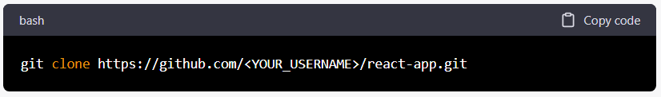
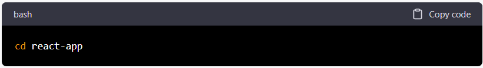
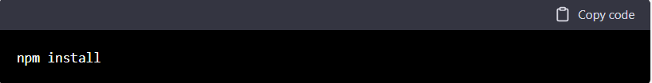
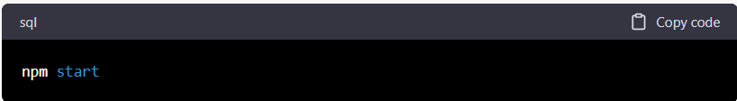

# Keeper-App
A clone of google notes

This is a React application that showcases the use of React components, JavaScript, CSS, HTML, hooks, state, and destructuring ,Spread Operator, Material-UI. The app provides a user-friendly interface and allows users to interact with the app in various ways.

# Getting Started
These instructions will get you a copy of the project up and running on your local machine for development and testing purposes.

# Prerequisites
You will need to have the following software installed on your computer:
 
 Node.js and npm

# Installing
1. Clone the repository to your local machine using the following command:

2. Navigate to the project directory:

3. Install the required packages:

# Running the project
To run the project, use the following command:

The project will start a local development server at http://localhost:3000/. Open a web browser and navigate to this address to view the React application.

# Built With
- React - A JavaScript library for building user interfaces
- JavaScript - A high-level programming language
- CSS - A stylesheet language used for describing the look and formatting of a document written in HTML
- HTML - A markup language used for creating web pages

# Contributing
If you would like to contribute to this project, please follow these steps:

1. Fork the repository
2. Create a new branch for your changes
3. Commit your changes and push to the branch
4. Create a pull request for your changes to be reviewed and merged

# Author
Kratik Soni
